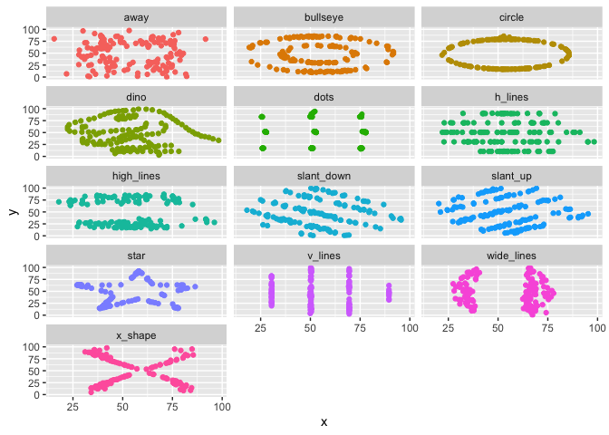

Lab 01 - Hello R
================
Enhui Wang
2024/01/15

## Load packages and data

``` r
library(tidyverse) 
library(datasauRus)
```

## Exercises

### Exercise 1

The dataset has 1846 rows and 3 columns. It includes variabels
‘dateset’,‘x’,and ‘y’.

### Exercise 2

The answers for this exercise are already provided to help guide you.
Clean up the narrative to reflect what you want to submit. Let’s break
it into steps:

First, let’s plot the data in the dino dataset:

``` r
dino_data <- datasaurus_dozen %>%
  filter(dataset == "dino")

ggplot(data = dino_data, mapping = aes(x = x, y = y)) +
  geom_point()
```

<!-- -->

Next, let’s calculate the correlation between `x` and `y` in this
dataset:

``` r
dino_data %>%
  summarize(r = cor(x, y))
```

    ## # A tibble: 1 × 1
    ##         r
    ##     <dbl>
    ## 1 -0.0645

The corrleation coefficent between x and y is r=-0.064, meaning that
there is no linear relationship between the x and y variables in the
‘dino’ dataset.

### Exercise 3

This is your turn to write the code and narrative for the star dataset.
Follow the same steps as above to complete the analysis. Don’t forget to
label your chunks appropriately!

``` r
#Filter the data for the star dataset
star_data <- datasaurus_dozen %>%
  filter(dataset == "star")
#Create a plot for the dataset
ggplot(data = star_data, mapping = aes(x = x, y = y)) +
  geom_point() 
```

<!-- -->

I’m some filler text, you should replace me with more meaningful text…

``` r
# Calculate the correlation coefficient for the star dataset
star_data %>%
  summarize(r = cor(x, y))
```

    ## # A tibble: 1 × 1
    ##         r
    ##     <dbl>
    ## 1 -0.0630

The corrleation coefficent between x and y is r=-0.0629, meaning that
there is no linear relationship between the x and y variables in the
‘star’ dataset. The r for star is almost identical as the r for dino,
indicating the star dataset does not have a stronger linear
relationship.

### Exercise 4

``` r
#Filter the data for the circle dataset
circle_data <- datasaurus_dozen %>%
  filter(dataset == "circle")

#Create the plot for the dataset
ggplot(data = circle_data, mapping = aes(x = x, y = y)) +
  geom_point() 
```

<!-- -->

``` r
#Calculate the correlation coefficient for the star dataset
circle_data %>%
  summarize(r = cor(x, y))
```

    ## # A tibble: 1 × 1
    ##         r
    ##     <dbl>
    ## 1 -0.0683

The corrleation coefficent between x and y is r=-0.06834336 , meaning
that there is no linear relationship between the x and y variables in
the ‘circle’ dataset. The r for circle is almost identical as the r for
dino, indicating the star dataset does not have a stronger linear
relationship.

### Exercise 5

``` r
ggplot(datasaurus_dozen, aes(x = x, y = y, color = dataset)) +
  geom_point() + 
  facet_wrap(~dataset, ncol = 3) +
  theme(legend.position = "none")
```

<!-- -->

``` r
  datasaurus_dozen %>%
  group_by(dataset) %>%
  summarize(r = cor(x, y)) %>%
  print(13)
```

    ## # A tibble:
    ## #   13 × 2
    ##    dataset   
    ##    <chr>     
    ##  1 away      
    ##  2 bullseye  
    ##  3 circle    
    ##  4 dino      
    ##  5 dots      
    ##  6 h_lines   
    ##  7 high_lines
    ##  8 slant_down
    ##  9 slant_up  
    ## 10 star      
    ## 11 v_lines   
    ## 12 wide_lines
    ## 13 x_shape   
    ## # ℹ 1 more
    ## #   variable:
    ## #   r <dbl>
